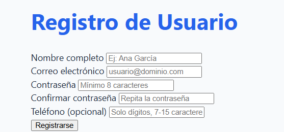
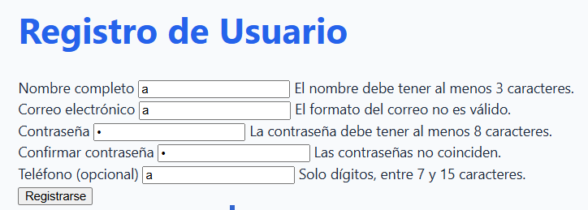
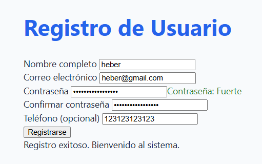

# Registro de Usuario - U4

## Descripción del Proyecto

Este proyecto es una interfaz de registro de usuario interactiva desarrollada para la Unidad 4. Incluye un formulario con validaciones en tiempo real para campos como nombre, correo electrónico, contraseña, confirmación de contraseña y teléfono opcional. El sistema mejora la experiencia del usuario (UX) proporcionando retroalimentación inmediata sobre errores de entrada y confirmando el éxito del registro.

## Tecnologías Utilizadas

- **HTML5**: Estructura semántica del formulario.
- **CSS3**: Diseño visual, layouts (Flexbox/Grid) y manejo de estados visuales.
- **JavaScript (ES6+)**: Lógica de validación personalizada, manipulación del DOM y manejo de eventos.

## Instrucciones de Ejecución

Siga estos pasos para ejecutar el proyecto localmente:

1. **Clonar el repositorio** (si aplica) o descargar los archivos del proyecto.
2. **Abrir el archivo `index.html`**:
   - Puede hacer doble clic directamente sobre el archivo [index.html](index.html) desde su explorador de archivos.
   - O bien, puede utilizar una extensión como **Live Server** en VS Code para una mejor experiencia de desarrollo.
3. **Interactuar con el formulario**: Intente completar los campos y observe las validaciones dinámicas.

## Capturas de Pantalla

### Interfaz Principal

### Validaciones en Tiempo Real

### Registro Exitoso

